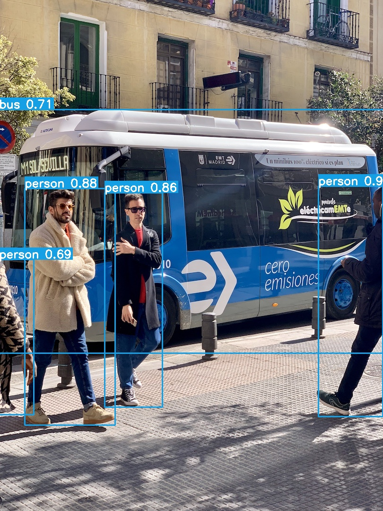
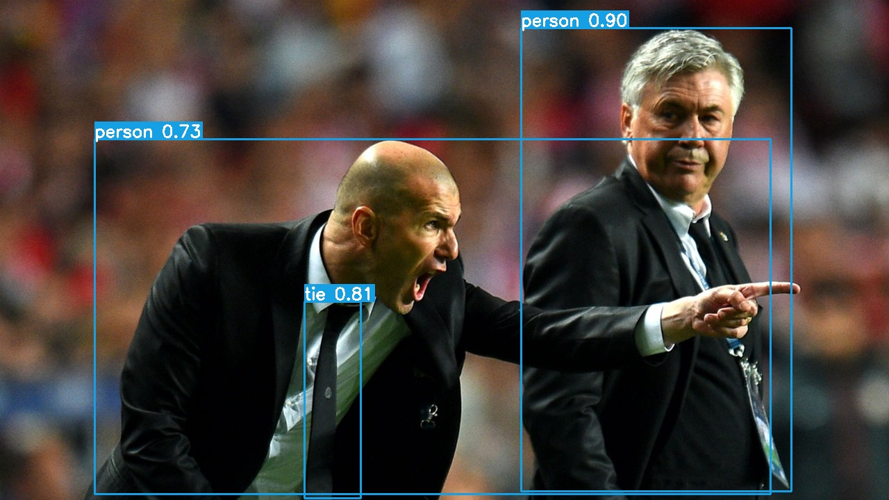

# yolov5_cpp项目说明文档
这个项目是一个使用YOLOv5模型进行目标检测的应用程序，它可以处理图片和视频。
同时，它使用了LIME算法 (Low-light Image Enhancement) 来增强输入图像的质量。
在处理过程中，此程序将显示三个窗口：原始输入帧、目标检测后的帧以及LIME增强后的检测帧。
C++ YOLO v5 ONNX Runtime inference code for object detection.


## Struct
```bash
├── build.sh             # 构建脚本
├── CMakeLists.txt       # CMake构建文件
├── images               # 示例图片和视频文件
├── include              # 头文件
│   ├── cmdline.h        # 命令行解析
│   ├── detector.h       # YOLO检测器定义
│   ├── lime.h           # LIME算法定义
│   ├── utils.h          # 实用工具函数
│   └── visualizer.h     # 可视化工具函数
├── lime                 # LIME算法相关文件
├── models               # 预训练YOLOv5模型和类别名称文件
├── README.md            # 项目说明文档
└── src                  # 源代码文件
    ├── add_fps.cpp      # 添加FPS显示功能
    ├── add_lime.cpp     # 添加LIME功能
    ├── add_thread.cpp   # 添加多线程功能
    ├── detector.cpp     # YOLO检测器实现
    ├── lime.cpp         # LIME算法实现
    ├── main.cpp         # 主程序
    ├── utils.cpp        # 实用工具函数实现
    └── visualizer.cpp   # 可视化工具函数实现
```

## Dependecies:
- OpenCV 4.x
- ONNXRuntime 1.12.0
- OS: Tested on Windows 10 and Ubuntu 20.04
- CUDA 11+ [Optional]

## Build

To build the project and run the following commands
```bash
cd yolov5_cpp
./build.sh
cd build

```

or

```bash
mkdir build
cd build
cmake
make
```

## Run
Before running the executable you should convert your PyTorch model to ONNX if you haven't done it yet. Check the [official tutorial](https://github.com/ultralytics/yolov5/issues/251).

`On Windows`: to run the executable you should add OpenCV and ONNX Runtime libraries to your environment path `or` put all needed libraries near the executable (onnxruntime.dll and opencv_world.dll).

Run from CLI,the --gpu(option):
- -m 或 --model_path：ONNX模型文件的路径
- -c 或 --class_names：类别名称文件的路径
- -i 或 --input：输入图像或视频文件的路径
- --gpu：（可选）使用GPU加速

```bash
./build.sh
cd build
./yolov5_cpp -m ../models/yolov5s.onnx -c ../models/coco.names -i ../images/bus.jpg --gpu
# On Windows ./yolo_ort.exe with arguments as above
```

## Demo

YOLOv5s onnx:

<p align="center">
  <a href="images/bus_result.jpg"></a>
</p>
<p align="center">
  <a href="images/zidane_result.jpg"></a>
</p>


## References

- YOLO v5 repo: https://github.com/ultralytics/yolov5
- YOLOv5 Runtime Stack repo: https://github.com/zhiqwang/yolov5-rt-stack
- ONNXRuntime Inference examples: https://github.com/microsoft/onnxruntime-inference-examples
